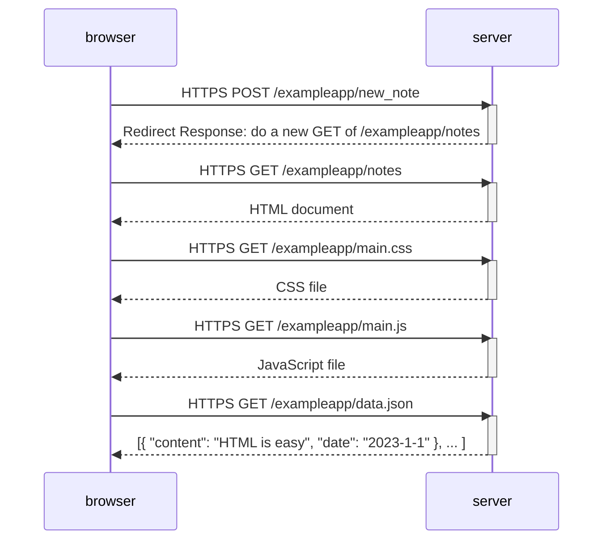

Excercise 0.4: New note diagram

```mermaid
sequenceDiagram
    participant browser
    participant server
    
    browser->>server: HTTPS POST /exampleapp/new_note
    activate server
    server-->>browser: Redirect Response: do a new GET of /exampleapp/notes
    deactivate server
    
    browser->>server: HTTPS GET /exampleapp/notes
    activate server
    server-->>browser: HTML document
    deactivate server
    
    browser->>server: HTTPS GET /exampleapp/main.css
    activate server
    server-->>browser: CSS file
    deactivate server
    
    browser->>server: HTTPS GET /exampleapp/main.js
    activate server
    server-->>browser: JavaScript file
    deactivate server
    
    browser->>server: HTTPS GET /exampleapp/data.json
    activate server
    server-->>browser: [{ "content": "HTML is easy", "date": "2023-1-1" }, ... ]
    deactivate server    
```
